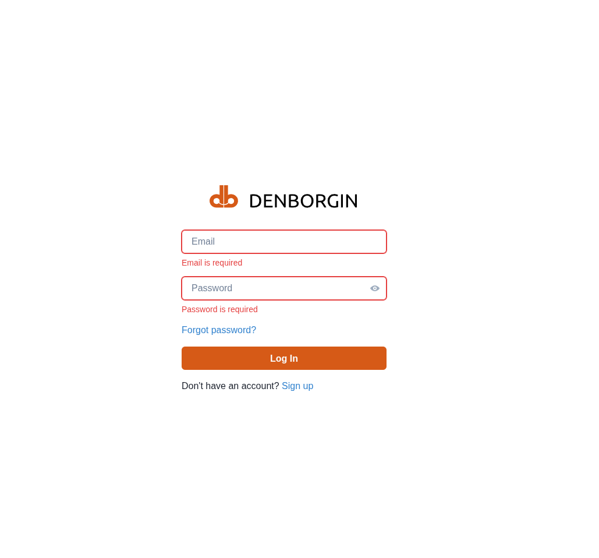
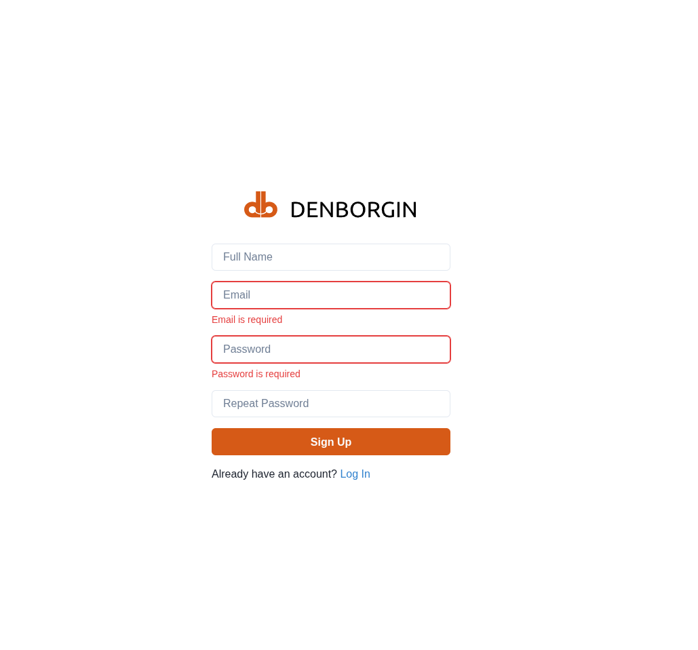
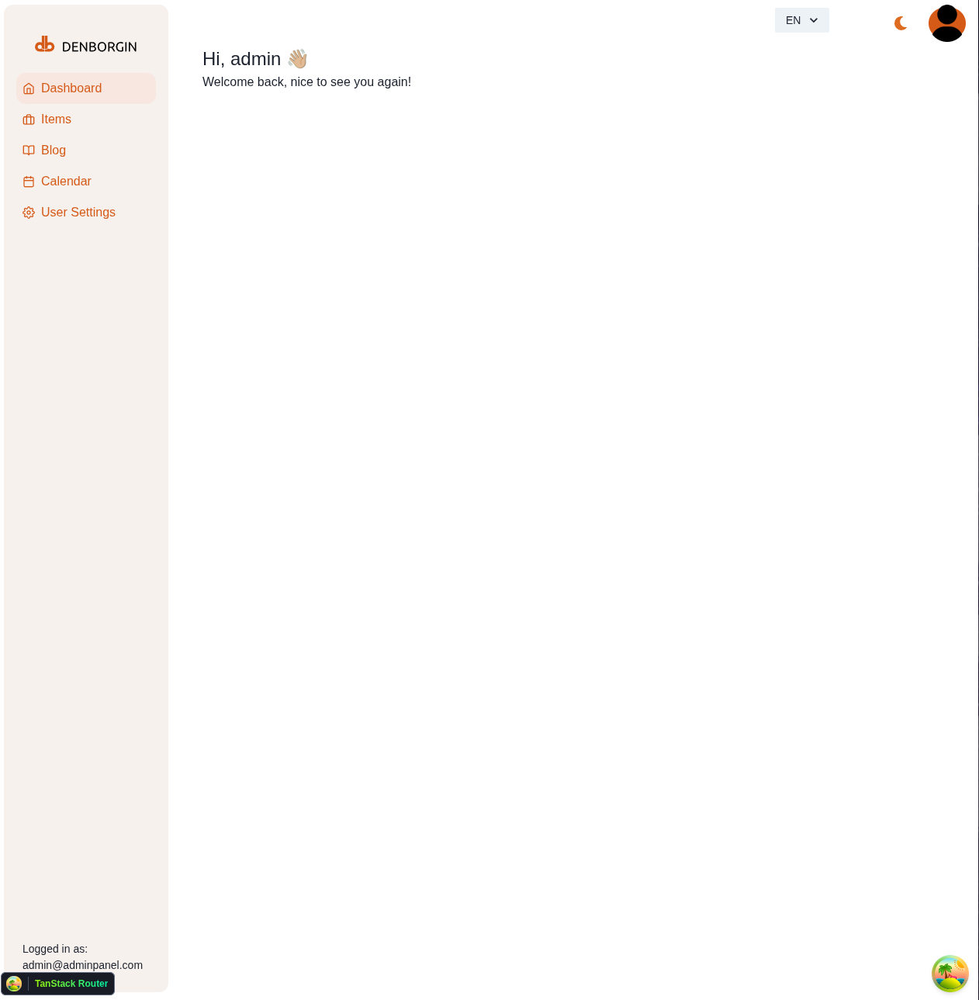
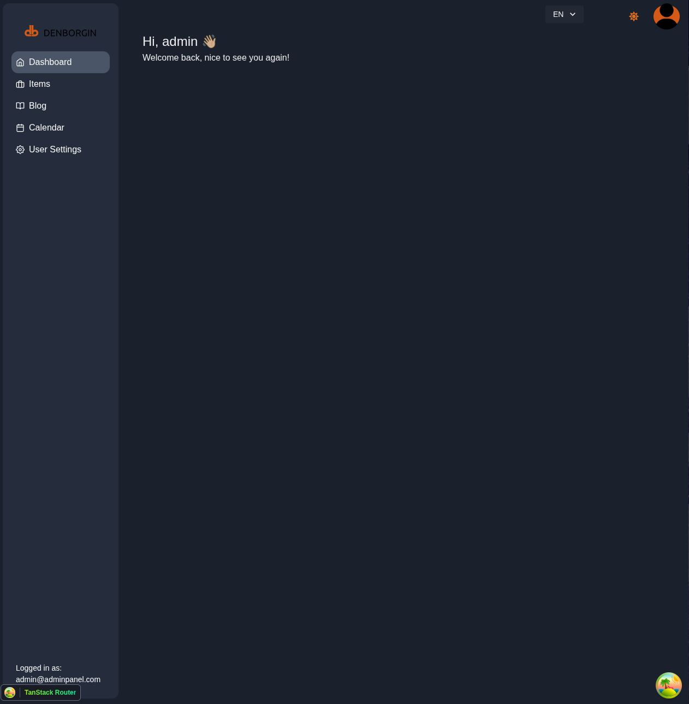
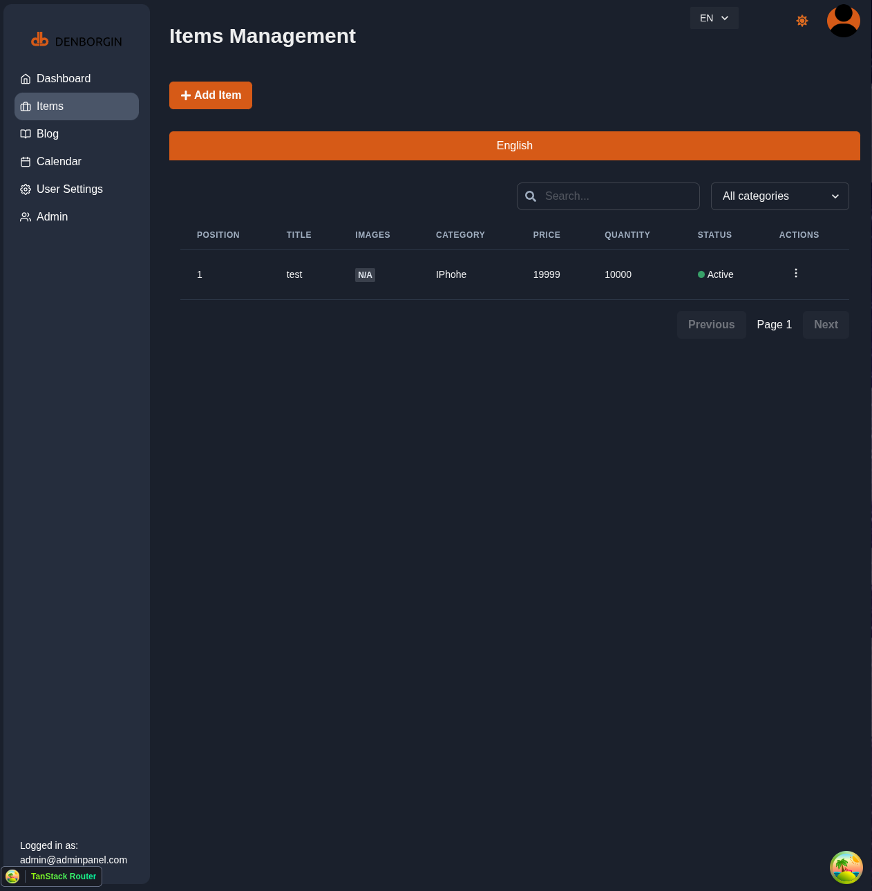
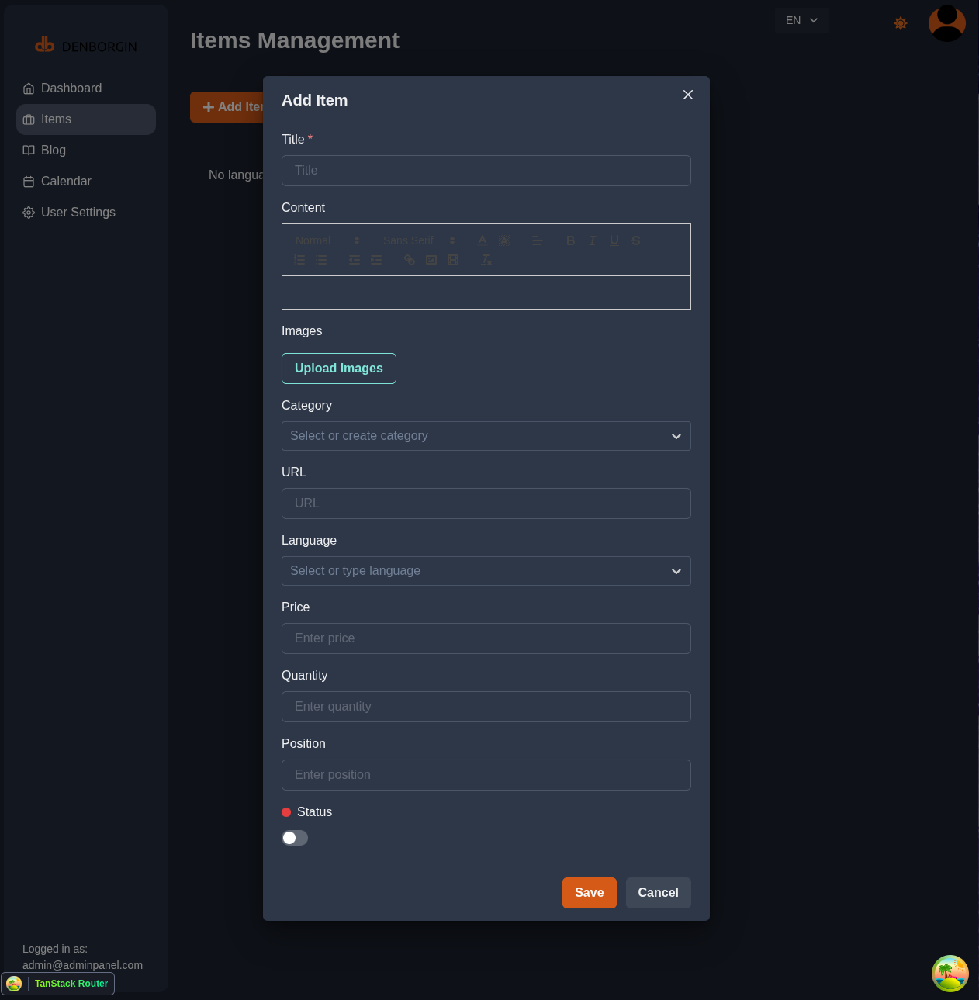
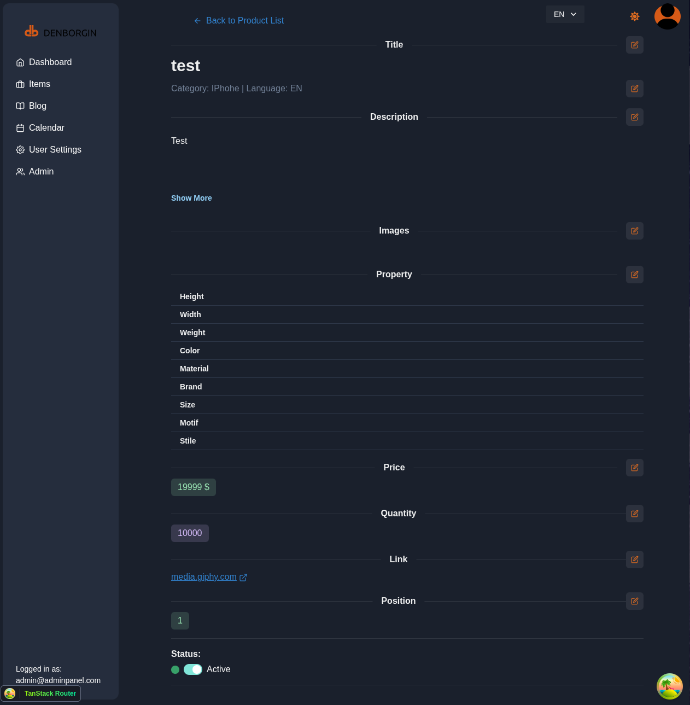
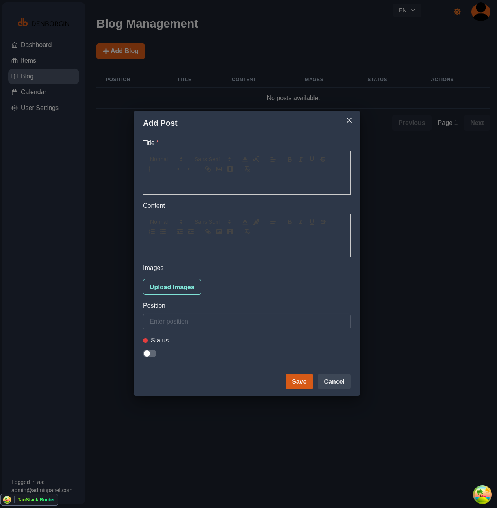
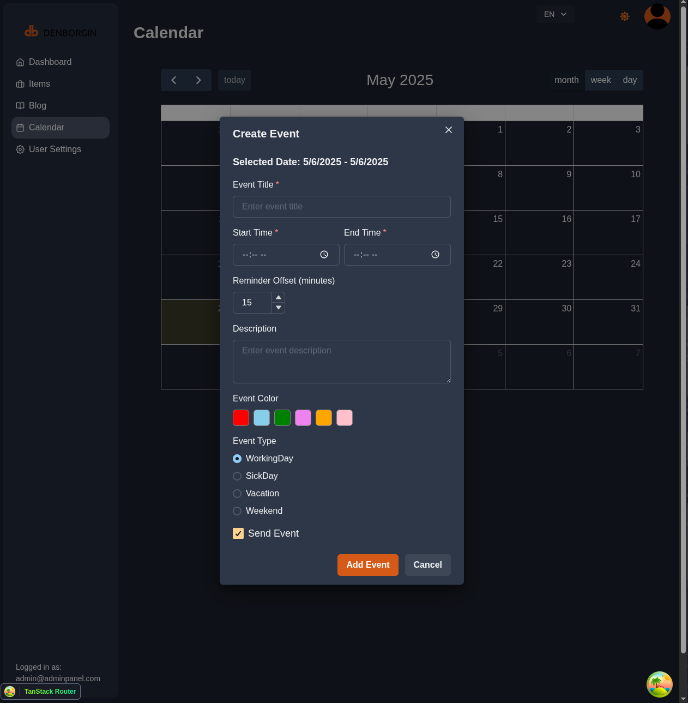
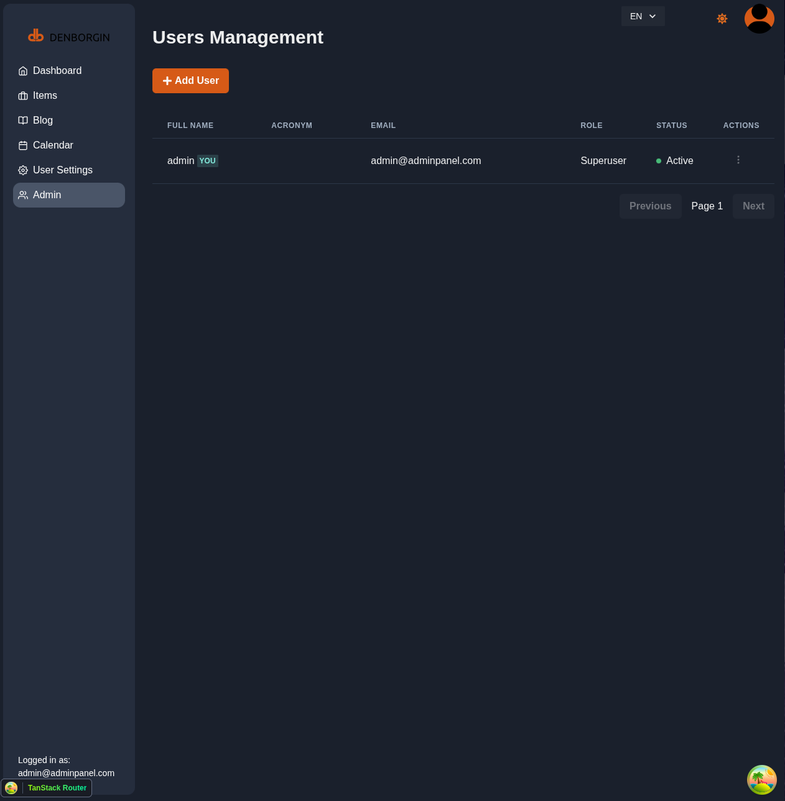

# 🛠️ Admin Panel

A full-featured **admin panel** built to manage users, products, blog posts, and media content efficiently.

## 📦 Features

- 🔐 User management: creation, editing, activation status, roles
- 🛍️ Product management: creation, editing, positioning, statuses
- ✍️ Blog system with image uploads
- 🖼️ Media handling via BlackBlaze B2
- 🌐 Support for CORS, JWT authentication, SMTP email

---
## 🖼️ Screenshots
### Login Page


### Sing Up Page


### Dashboard


### Dashboard Dark


### Items Management


### Create Item


### Edit Item


### Blog Management


### Calendar


### User Management



## 🚀 Getting Started

### 📁 Run from `admin-panel`

```bash
cd admin-panel

# Frontend
cd frontend
npm install
npm run dev

# Backend
cd ../backend
go run main.go

```
### 🐳 Run with Docker Compose
```bash
docker compose up -d --build
```
### ⚙️ Environment Setup

- You must create .env and .env.production files in the following directories:

- frontend/.env and frontend/.env.production

- backend/.env and backend/.env.production

- root directory: .env and .env.production

### 🔧 Example .env (root level)
```env
DOMAIN=localhost
FRONTEND_HOST=http://localhost:5173

# Environment: local, staging, production
ENVIRONMENT=local
GIN_MODE=release
APP_RUN_PORT=:5180

PROJECT_NAME="Admin Panel"
STACK_NAME=adminka

# Backend CORS
BACKEND_CORS_ORIGINS="http://localhost,http://localhost:5173,http://localhost:3000,https://localhost,https://localhost:5173,"
SECRET_KEY=
ALGORITHM=HS256

# Email (SMTP)
SMTP_HOST=smtp.forwardemail.net
SMTP_USER=
SMTP_PASSWORD=
EMAILS_FROM_EMAIL=
SMTP_TLS=True
SMTP_SSL=True
SMTP_PORT=465

# PostgreSQL
POSTGRES_SERVER=
POSTGRES_PORT=5432
POSTGRES_DB=
POSTGRES_USER=
POSTGRES_SSLMODE=disable
POSTGRES_TIMEZONE=

# Sentry (optional)
SENTRY_DSN=

# Backblaze B2
BACKBLAZE_ID=
BACKBLAZE_KEY=
BUCKET_NAME_ITEMS=

# Docker Images
DOCKER_IMAGE_BACKEND=backend
DOCKER_IMAGE_FRONTEND=frontend

# SSH Deployment
SSH_PASSWORD=
SSH_HOST=
SSH_USER=

# Docker Hub (optional)
DOCKER_USERNAME=
DOCKER_PASSWORD=
```